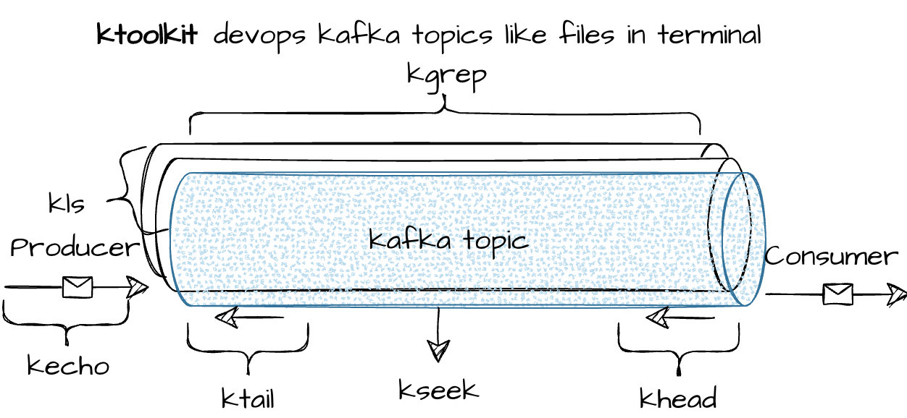

# ktookkit (kafka toolkit)



# Getting Started

## build

```
cargo build
```

## usage

```
# show all topics
kls localhost:9092
 # | topics            | partitions 
---+-------------------+------------
 1 | quickstart-topic  | 1 

# send a json object
kecho localhost:9092 quickstart-topic '{"msg":"hello world!"}'

# scan all message
khead  localhost:9092 quickstart-topic
quickstart-topic:0@5:{"msg":"hello world!"}

# tail topic
ktail localhost:9092 quickstart-topic
```

# thanks

* https://github.com/phsym/prettytable-rs
* https://github.com/kafka-rust/kafka-rust

# other kafka tools

* [kcat](https://github.com/edenhill/kcat) 
